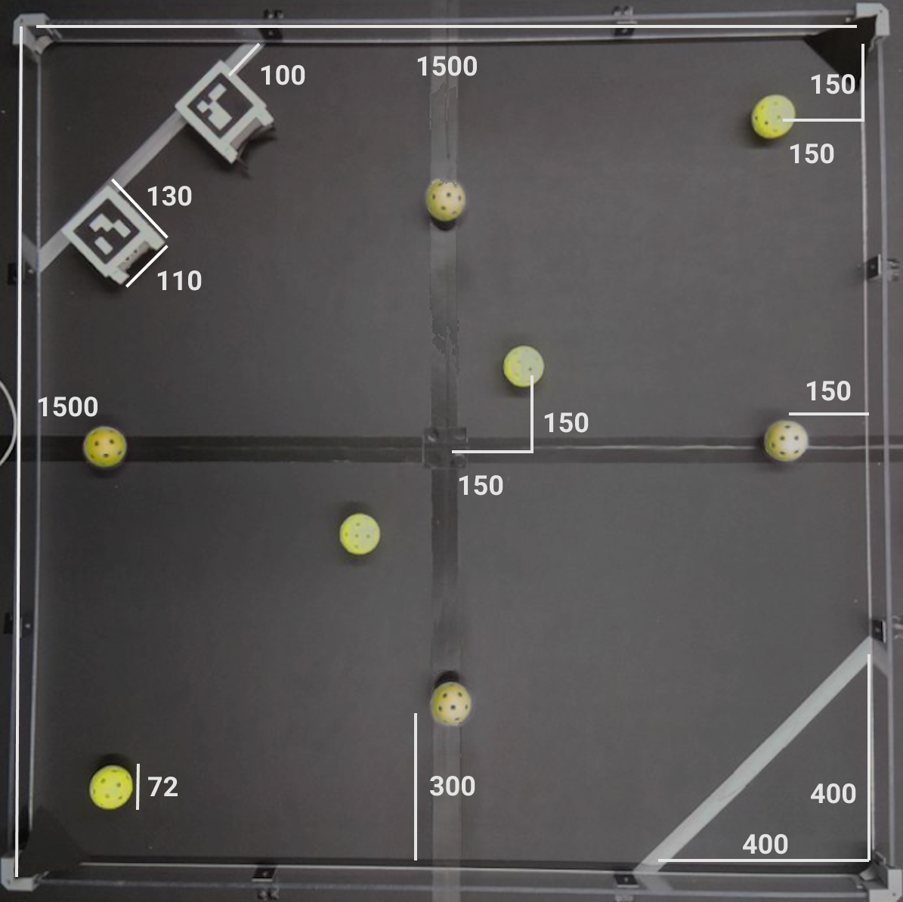

# Micro Invaders 2024 Competition Rules

**NOTE that the rules are currently under revision for the 2024 competition and may receive any changes until May 31st.** 

This document outlines the rules the Robot Uprising: Micro Invaders 2024 Competition. The competition lives with the community so feel free to suggest rule changes by creating _an issue_ or _a pull request_, if you have ideas that.

## Game Logic

The game is played between two teams battling each other in short 3 or 5 rounds showdowns. Each team has two autonomous robots playing for their side at a time. All teams start with 0 points. Teams can either try to increase their points or win by goaling 3 corrupt energy cores to the opponent's base.

The points are increased by collecting positive energy cores, balls, to the team's base. A point is given when an energy core stays inside the base and does not bounce off. The energy core doesn't have to be stopped to receive the point. After a point is given, the referee picks the energy core from the base by hand. Robots are not allowed to go intentionally inside their own base.

If the team receives 3 corrupt energy cores, their base is destroyed, and the opponent wins. If both teams are alive at the end of a game, the team holding greater energy count will overpower their opponent and win. In the case of a tie, the team that collected the first energy core, wins.

The round ends after 2.5 minutes or if all the energy cores are collected.

## Starting Setup

The game is played in a square-shaped 1.5x1.5m arena with multiple energy cores located on the arena. Two corners of the arena will function as bases, one for each team.

At the start of each round, the competing robots are placed in front of their base.

The back of the robot must be touching its goal bump, and side of the robot must be 100 mm away from the wall. The distance is measured along with the goal bump.

## Energy Cores

Energy cores are presented in the challenge as floorball balls in the area. The robots are able to push them around with ease.

One of the corners with a bump has a tube filled with pink cores and the the tube spits out one pink core to the arena every 30s beginning from 0:30 
and lasting until 2:00, spitting out 4 corrupt cores in total.

Green cores = positive cores (gain +1 point).\
Pink cores = corrupt cores (if the team scores 3 of these to the opponent's goal, that team wins)

## Robots

The team receives their robot model around 1 month before the competition, and each team will be assigned to have two unique ArUco markers.

Each team is can 3D-print their own robots and their ArUco markers or get them from the organizer. The organizer is also allowed to help and give, e.g. spare parts if needed.

The color of the robot should be either black or white. Others colors can be used only if the colors cannot be seen at all from the top-down view camera.

On top of each robot, there must be an ArUco marker. The markers should point directly up. See the more detailed rules under the ArUco section.

Teams are allowed to attach their own custom accessories/parts at the front of the robots. The accessories must be 3D-printed, and their color must be either black or white. With the front accessory, the length of the robot should be at max 165mm and the width of which 120mm. The front accessories are not allowed to block any ArUco markers.

The robots are not allowed to break nor destroy other robots, but nonharmful harassment, such as blocking or ramming, is allowed.\
Hacking of the robots by taking advance of the way robots communicate or manipulating the scoreboard system is strictly prohibited.

## Arena

Units are in millimeters. The lighting of the arena is bound to change. The energy cores and the robots of one team are in their starting positions. 

The game is played on a 1.5m x 1.5m square arena. Two opposing corners are designated as the bases for the teams. The color of the ground is greyish-black. The color of the base does not look different from the ground.

In the borderline of scoring areas, there are small greyish-white bumps that prevent energy cores from going to the area without push or significant speed. The bump separates the goal from the actual game area.

The two corners, marked with black, have small bumpers that prevent the balls from getting stuck in the corners, where the robots might have trouble retrieving them.

One of the corners with a bump also has a tube filled with corrupt energy cores and the the tube spits out one corrupt core to the arena every 30s beginning from 0:30 and lasting until 2:00, spitting out 4 corrupt cores in total.

The robots are roughly 130mm x 110mm without any accessories. With the accessories, the maximum allowed size is 165mm x 120mm. The energy cores have a diameter of 72mm.

## ArUco Markers

AruCo Markers' dictionary should be 4x4. The markers should be generated from this site [chev.me/arucogen](https://chev.me/arucogen/).

The orientation of the marker from the generator must be aligned and relative to the forward motion of your robot. In other words, the top of the webpage corresponds to the front of your robot.

The dimensions of the ArUco marker must be 85mm x 85mm. The dimensions are measured from the black area. Around the marker, there should be 15mm white space. So, the combined dimensions are 115mm x 115mm.

The participants are responsible for printing their own AruCo markers. Each team is going to be assigned its own marker IDs.

## Disclaimer

The idea of the competition is to gather like-minded people together and have fun. We encourage teams to help each other, and we, the organizers, are more than happy to help the teams to succeed. No need to take this competition too seriously :)

Everything is subject to change.
