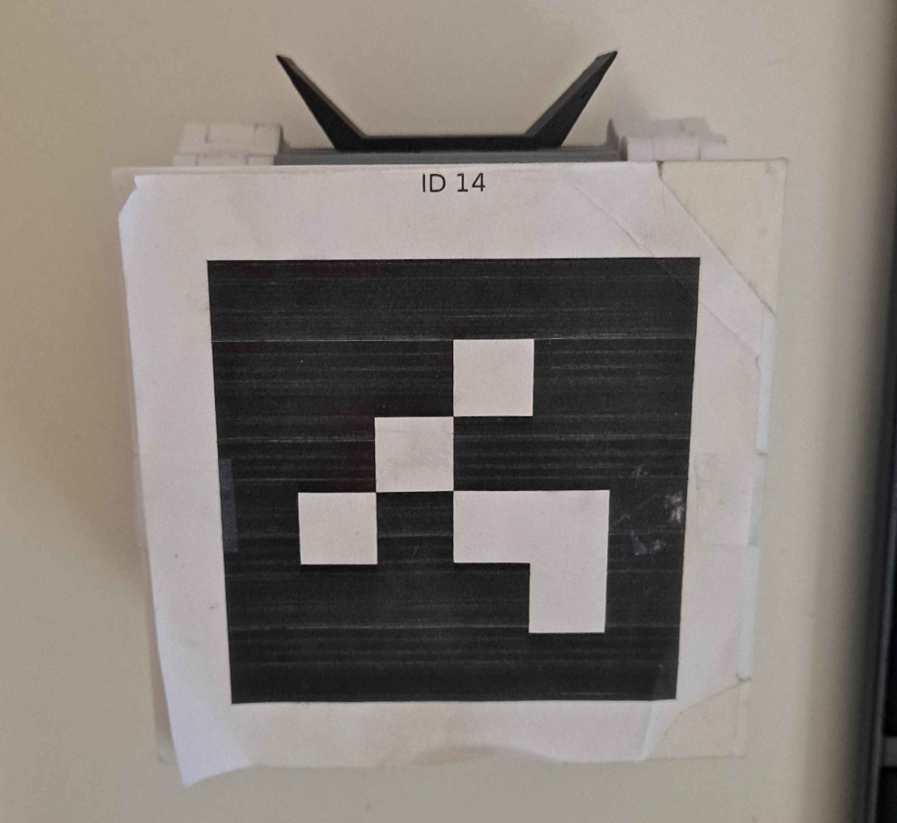

# Micro Invaders 2024 Competition Rules

This document outlines the rules the Robot Uprising: Micro Invaders 2024 Competition. The competition lives with the community so feel free to suggest rule changes by creating _an issue_ or _a pull request_, if you have ideas that would improve the game.

## Game Logic

Each team has two autonomous robots playing for their side at a time. All teams start with 0 points. Teams can either try to increase their points or win by scoring 3 corrupt energy cores to the opponent's base (goal).

The points are increased by collecting energy cores (yellow balls) to the team's base. A point is given when an energy core stays inside the base and does not bounce off. The energy core doesn't have to be stopped to receive the point. After a point is given, the referee picks the energy core from the base by hand. Robots are not allowed to go intentionally inside their own base.

If the team's base receives 3 corrupt cores (red balls), their base is destroyed, and the opponent wins regardless of the scoring situation. If both teams are alive at the end of a game, the team holding greater energy count will overpower their opponent and win. In the case of a tie, the team that scored the first core of either type (but not corrupt to own base), wins.

The round ends after 2.5 minutes or if all the cores are collected.

Micro Invaders is played between two teams battling each other in games that consist of short rounds for "best of three" or "best of five" in case of the final, i.e. first team to win 2 or 3 rounds wins the game.

## Starting Setup

The game is played in a square-shaped 1.5x1.5m arena with multiple cores located on the arena. Two opposing corners of the arena will function as bases, one for each team.

At the start of each round, the competing robots are placed in front of their base.

The back of the robot must be touching its team's goal bump, and side of the robot must be 100 mm away from the wall. The distance is measured along with the goal bump.

## Energy Cores

Energy cores are presented in the challenge as floorball balls in the area. The robots are able to push them around with ease.

The standard starting setup includes 8 yellow energy cores on the field spaced at equally on the field. Red corrupt cores enter from the corners every 30s beginning from 0:30 and lasting until 2:00, spitting out 4 corrupt cores in total. This setup is used _unless affected by specific player actions or other higher power_.

Yellow balls = Energy cores (gain +1 point).
Red balls = Corrupt cores (if a team scores 3 of these to the opponent's base/goal, the opponent is eliminated regardless of the points)

## Robots

The competition robot 3D models and parts lists are available in the [hardware repo](https://github.com/robot-uprising-hq/ai-robot-hardware) and the teams may begin preparing their robots at any point. For the 2024 competition the robot electronics are provided to the teams by the organisers. This is planned to happen during June.

### 3D-printed parts
The robot consists of mainly 3D-printed parts that are available as .STLs in the [hardware repo](https://github.com/robot-uprising-hq/ai-robot-hardware). Each team is encouraged to 3D-print their own robots but help is also available from the organisers should the team not have access to 3D printers or if some parts turn out otherwise challenging.

**The color of the robot must be mainyl grayscale**, i.e something black, white or between. Others colors can be used only if the colors cannot be seen at all from the top-down view camera. This is to prevent interference with the core detection by color.

### Accessories and customisation

Teams are allowed to attach their own custom accessories/parts at the front of the robots. The accessories must be 3D-printed, and their color must be either black or white. With the front accessory, the length of the robot should be at max 180mm and the width of which 120mm. The height of the accessories must not surpass the height of the AruCo marker on top of the robot. The front accessories are not allowed to on purpose block any ArUco markers.

The robots are not allowed to break nor destroy other robots, but nonharmful harassment, such as blocking or ramming, is allowed. All customisations are subject to review by the organisers.

**Any custom accessories used in the tournament** must be released under an open source license after the tournament that allows other competitors to take advantage of the same designs in the following competitions.

### Robot electronics

The competition robots must use the formal electronics hardware listed in the [hardware repo](https://github.com/robot-uprising-hq/ai-robot-hardware) which is provided to the competitors by the organisers (or can be otherwise acquired by enthusiasts). Minor differences in the components may be allowed due changes in suppliers etc. over the years, but in general the customisation of the electronics is out of scope for the competition. I.e. it's not allowed to upgrade the robot with more powerful motors.

### Robot Identification

On top of each robot, there must be an ArUco marker which must point directly up and be clearly visible in the top down video stream of the arena.

The organisers will assing each team two unique ArUco markers to be used with their robots. No other IDs may be used than the assigned ones.

AruCo markers dictionary used is 4x4 and the markers are to be generated from this site [chev.me/arucogen](https://chev.me/arucogen/). The participants are responsible for printing their own AruCo markers corresponding to their assigned IDs.

The orientation of the marker from the generator must be aligned and relative to the forward motion of your robot. In other words, the top of the webpage corresponds to the front of your robot.

The dimensions of the ArUco marker must be 85mm x 85mm. The dimensions are measured from the black area. Around the marker, there should be 15mm white space. So, the combined dimensions are 115mm x 115mm.

## Arena

Units are in millimeters. The lighting of the arena is bound to change. The energy cores and the robots of one team are in their starting positions. 

The game is played on a 1.5m x 1.5m square arena. Two opposing corners are designated as the bases for the teams. The color of the ground is greyish-black. The color of the base does not look different from the ground.

In the borderline of scoring areas, there are small greyish-white bumps that prevent energy cores from going to the area without push or significant speed. The bump separates the goal from the actual game area.

The two corners, marked with black, have small bumpers that prevent the balls from getting stuck in the corners, where the robots might have trouble retrieving them.

One of the corners with a bump also has a tube filled with corrupt energy cores and the the tube spits out one corrupt core to the arena every 30s beginning from 0:30 and lasting until 2:00, spitting out 4 corrupt cores in total.

The robots are roughly 130mm x 110mm without any accessories. With the accessories, the maximum allowed size is 165mm x 120mm. The energy cores have a diameter of 72mm.

## Game Network

The tournament uses a wireless local network to enables the competitors' devices to command their robots over UDP. The competitors must ensure they only send commands to their own robots IPs and not to any other robot. The solutions must command their robot at a reasonable pace that does not cause unnecessary strain on the network and a rate limit may be enforced if necessary. Competitors must disconnect from the Game Network while they are not actively playing a game in the tournament.

[Hacking of the robots](https://www.youtube.com/watch?v=Vm7DR6lHQLc&t=540s) by taking advance of the way robots communicate or in any way manipulating the scoreboard system is strictly prohibited.

## Disclaimer

The idea of the competition is to gather like-minded people together and have fun. We encourage teams to help each other, and we the organisers are more than happy to help the teams to succeed. No need to take this competition too seriously :)

Everything is subject to change.
